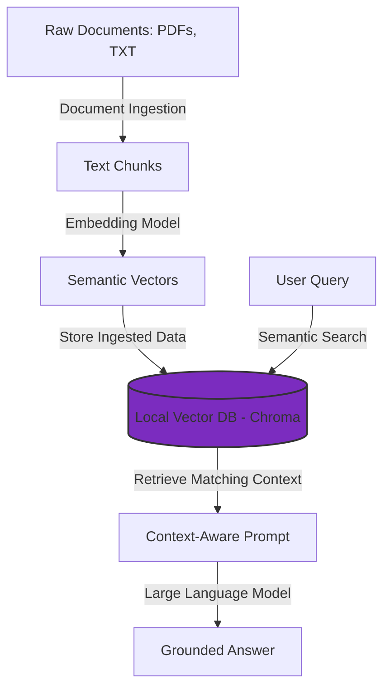
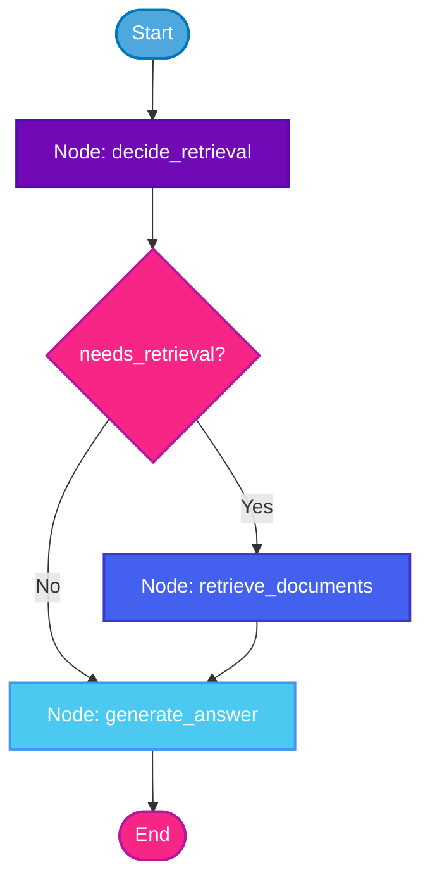

# RAG Playground: A Collection of Retrieval-Augmented Generation Projects

Welcome to the **RAG Playground**! This repository is a central hub showcasing different implementations of Retrieval-Augmented Generation (RAG) systems. It transitions from a modular vector storage and retrieval pipeline to advanced, state-based agentic workflows.

Each project inside this portfolio is isolated into its own folder, making it clean, organized, and straightforward to run.

---

## 📂 Repository Structure

```
Rag/
├── .env.example             ⚙️ Root template for environment configurations
├── .gitignore               ⚙️ Git ignore settings for secrets & caches
├── README.md                📖 Repository documentation (this file)
├── requirements.txt         📋 Unified Python requirements for both versions
│
├── 01_basic_rag/            📂 Version 1: Basic RAG Pipeline
│   ├── data/                📄 Text & PDF source files (e.g. python.txt, ML textbooks)
│   ├── input.txt            📄 Sample query text input
│   └── rag_pipeline.ipynb   📓 Jupyter Notebook containing the end-to-end basic pipeline
│
└── 02_agentic_rag/          📂 Version 2: Agentic RAG with LangGraph
    ├── .env.example         ⚙️ Folder-level template for API keys
    └── 1-agenticrag.ipynb   📓 Stateful LangGraph notebook with routing & conditional retrieval
```

---

## 🌟 What is RAG? (Open-Book Analogy)

If you ask a general AI a question about highly specialized information, personal files, or textbooks (like machine learning or anatomy), it might hallucinate or fail to answer. 

**RAG (Retrieval-Augmented Generation)** solves this by connecting a smart search system to your AI:
1. **Retrieval**: The system searches a local database of your documents for context matching the question.
2. **Augmentation**: It retrieves the most relevant snippets and pastes them into the prompt.
3. **Generation**: It hands those snippets to the AI as a reference sheet, ensuring a highly accurate, grounded answer.

---

## 🛠️ Reorganized Implementations

### 1. Base RAG Pipeline (`01_basic_rag/`)
* **Focus**: A modular, general-purpose document search pipeline using local resources.
* **How it works**:
  * **Loading**: Reads plain text (`.txt`) and PDF files (`.pdf`) using LangChain document loaders.
  * **Chunking**: Splits large documents into smaller, overlapping paragraphs.
  * **Embeddings**: Converts text blocks into mathematical vectors using the `all-MiniLM-L6-v2` SentenceTransformer model.
  * **Database**: Indexes and saves embeddings locally in a **Chroma DB** vector store.
  * **Retrieval**: Performs fast semantic searches using cosine similarity to find documents closest in meaning to your query.
* **Data Flow**:


### 2. Agentic RAG with LangGraph (`02_agentic_rag/`)
* **Focus**: State machine workflow with LLM decision-making and conditional execution.
* **How it works**:
  * It defines a stateful graph via **LangGraph** where the system dynamically decides whether it needs to query a vector store or answer directly based on the user's question.
  * **State Definition**: Evaluates state properties (`question`, `documents`, `answer`, `needs_retrieval`).
  * **Graph Nodes**:
    * `decide_retrieval`: Employs keywords to decide if the prompt requires external document retrieval.
    * `retrieve_documents`: Queries a local **FAISS** vector store using OpenAI Embeddings if retrieval is triggered.
    * `generate_answer`: Formulates the final response using an OpenAI Chat model (e.g. `ChatOpenAI`), feeding it the context if retrieved, or directly answering otherwise.
  * **Conditional Edges**: Evaluates `needs_retrieval` to determine if control flows to `retrieve_documents` or straight to `generate_answer`.
* **State Machine Workflow Diagram**:


---

## 🚀 Setup & Execution Guide

This repository supports setup using either **[uv](https://github.com/astral-sh/uv)** (an extremely fast Python package installer and resolver written in Rust) or standard **pip**.

### Prerequisites
Make sure you have **Python 3.10+** installed. If using `uv`, install it via:
```bash
# On Windows:
powershell -c "irm https://astral.sh/uv/install.ps1 | iex"

# On macOS/Linux:
curl -LsSf https://astral.sh/uv/install.sh | sh
```

### 1. Initialize & Activate Virtual Environment
Run the following in the repository root directory:

#### Option A: Using `uv` (Recommended)
```bash
# Create environment
uv venv

# Activate it (Windows)
.venv\Scripts\activate

# Activate it (macOS/Linux)
source .venv/bin/activate
```

#### Option B: Using standard Python venv
```bash
# Create environment
python -m venv .venv

# Activate it (Windows)
.venv\Scripts\activate

# Activate it (macOS/Linux)
source .venv/bin/activate
```

### 2. Install Project Dependencies
Install the required packages using the unified `requirements.txt`:

```bash
# If using uv:
uv pip install -r requirements.txt

# If using pip:
pip install -r requirements.txt
```

### 3. Configure Environment Variables
Version 2 uses OpenAI's API. You must configure your API key before running:

1. Copy the `.env.example` file and rename it to `.env`:
   ```bash
   copy .env.example .env
   ```
2. Open the `.env` file in your editor and paste your OpenAI API key:
   ```env
   OPENAI_API_KEY=sk-proj-...
   ```

### 4. Run Notebooks
Launch the Jupyter notebook server:

```bash
# If using uv:
uv run jupyter notebook

# If using standard python:
jupyter notebook
```
Navigate to either the `01_basic_rag/` or `02_agentic_rag/` folder inside Jupyter to run the notebooks!
